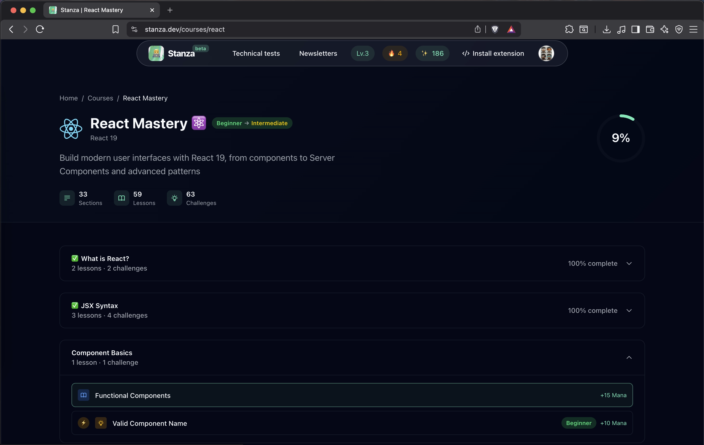
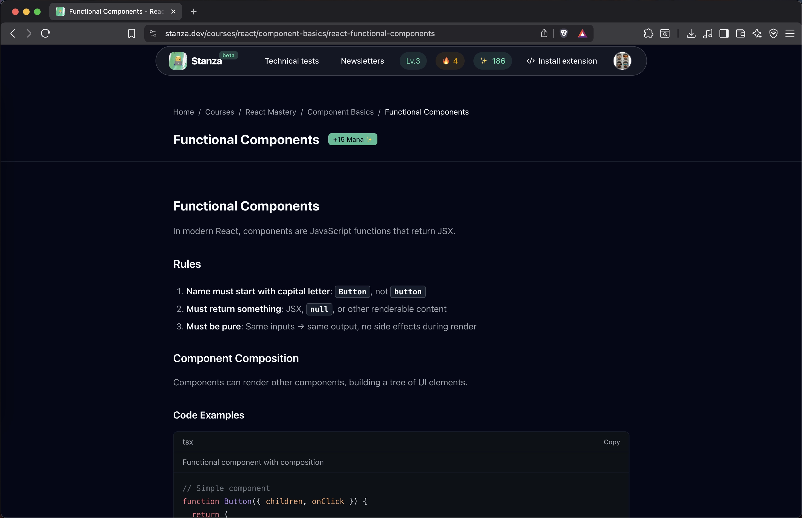
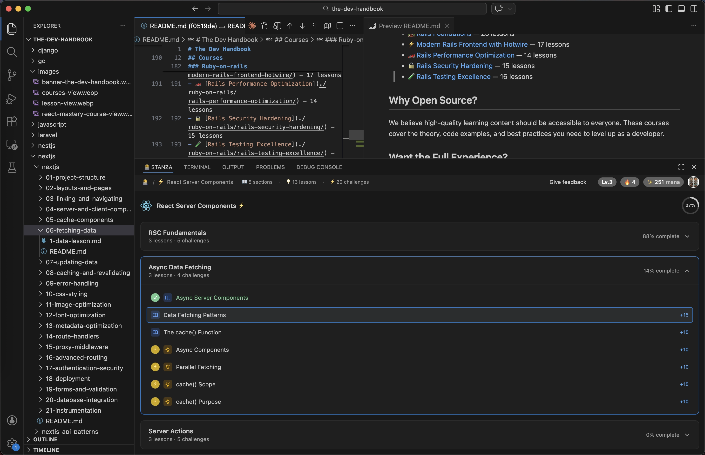
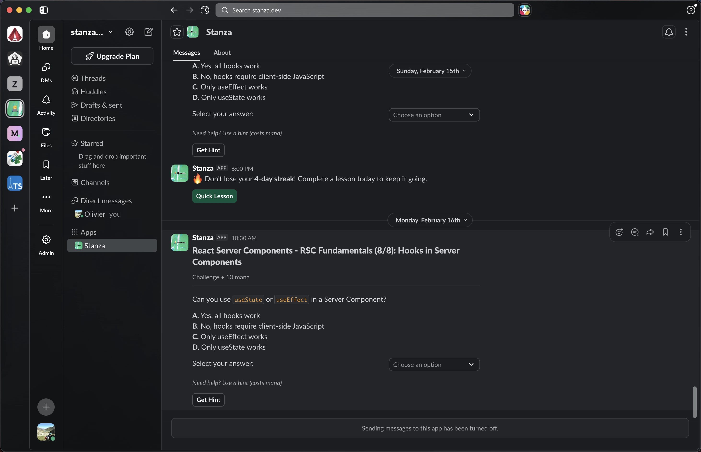

# The Dev Handbook

> Free, open-source developer courses — React, Next.js, TypeScript, Go, Python & more.

Maintained by [Stanza](https://stanza.dev) — Learn coding faster right in your IDE, Slack, emails and the web.

**132 courses** · **2207+ lessons** · **17 technologies**

## Courses

### ⚛️ React

- ♿ [React Accessibility (a11y)](./react/react-accessibility/) — 18 lessons
- ⚙️ [React Advanced APIs](./react/react-advanced-apis/) — 14 lessons
- ✨ [React Animation & Motion](./react/react-animation/) — 16 lessons
- 🧩 [React Components & Patterns](./react/react-components-patterns/) — 12 lessons
- 🪝 [Building Custom Hooks](./react/react-custom-hooks/) — 15 lessons
- 📡 [React Data Fetching Patterns](./react/react-data-fetching/) — 18 lessons
- 📝 [React Form Mastery](./react/react-forms/) — 19 lessons
- ⚓ [React Hooks Deep Dive](./react/react-hooks-deep-dive/) — 19 lessons
- ⚛️ [React Intermediate](./react/react-intermediate/) — 58 lessons
- ⚛️ [React 19 & Patterns](./react/react-modern-patterns/) — 21 lessons
- ⚡ [React Performance Deep Dive](./react/react-performance/) — 15 lessons
- 🏗️ [React Project Architecture](./react/react-project-architecture/) — 13 lessons
- ⚡ [React Server Components](./react/react-server-components/) — 13 lessons
- 🏛️ [React State Architecture](./react/react-state-architecture/) — 16 lessons
- 🧪 [React Testing Strategies](./react/react-testing/) — 18 lessons
- 📘 [React TypeScript Mastery](./react/react-typescript/) — 17 lessons
- ⚛️ [React Basics](./react/react/) — 24 lessons

### ▲ Next.js

- 🔌 [Next.js API Routes & Patterns](./nextjs/nextjs-api-patterns/) — 16 lessons
- 🌍 [Next.js Internationalization](./nextjs/nextjs-i18n/) — 20 lessons
- 🚀 [Next.js Performance & Optimization](./nextjs/nextjs-optimization/) — 20 lessons
- 🔐 [Next.js Proxy & Authentication](./nextjs/nextjs-proxy-auth/) — 20 lessons
- 🧪 [Next.js Testing Strategies](./nextjs/nextjs-testing/) — 20 lessons
- ▲ [Next.js Full-Stack](./nextjs/nextjs/) — 24 lessons

### 🔷 TypeScript

- 🧙‍♂️ [TypeScript Type System Mastery](./typescript/typescript-advanced-types/) — 6 lessons
- 🏛️ [TypeScript Architecture & Patterns](./typescript/typescript-architecture/) — 6 lessons
- 🏭 [TypeScript in Production](./typescript/typescript-production/) — 5 lessons
- 🔷 [TypeScript Essentials](./typescript/typescript/) — 10 lessons

### 🟨 JavaScript

- ⏳ [Async JavaScript: Promises & Patterns](./javascript/javascript-async-patterns/) — 24 lessons
- 📐 [JavaScript Design Patterns](./javascript/javascript-design-patterns/) — 20 lessons
- λ [Functional JavaScript Architecture](./javascript/javascript-functional-architecture/) — 20 lessons
- ⚡ [JavaScript Under the Hood](./javascript/javascript-performance-internals/) — 20 lessons
- 🟨 [JavaScript Core Mastery](./javascript/javascript/) — 40 lessons

### 💚 Vue

- ✨ [Vue Animations & Transitions](./vue/vue-animations/) — 7 lessons
- 🧩 [Vue Component Architecture](./vue/vue-component-architecture/) — 11 lessons
- 🧩 [Vue Composition API & Composables](./vue/vue-composition-api/) — 10 lessons
- 💚 [Vue Foundations](./vue/vue-foundations/) — 24 lessons
- 🍍 [State Management with Pinia](./vue/vue-pinia/) — 10 lessons
- ⚡ [Vue Reactivity Mastery](./vue/vue-reactivity-mastery/) — 12 lessons
- 🧭 [Vue Router: Complete Navigation Guide](./vue/vue-router/) — 11 lessons
- 🌐 [Vue Server-Side Rendering & Nuxt](./vue/vue-ssr-nuxt/) — 9 lessons
- 🧪 [Vue Testing Strategies](./vue/vue-testing/) — 7 lessons
- 📘 [TypeScript with Vue](./vue/vue-typescript/) — 8 lessons

### 🔥 Svelte

- 🔥 [Svelte 5: The Complete Guide](./svelte/svelte-5-complete-guide/) — 20 lessons
- 🏢 [Enterprise Svelte: Testing & Architecture](./svelte/svelte-5-enterprise/) — 15 lessons
- 👆 [Event Handling & User Interaction](./svelte/svelte-5-events/) — 17 lessons
- 📦 [Moving to Svelte 5](./svelte/svelte-5-migration/) — 15 lessons
- 🎭 [Motion & Transitions](./svelte/svelte-5-motion/) — 14 lessons
- 🏎️ [Under the Hood & Performance](./svelte/svelte-5-performance/) — 15 lessons
- 🔮 [Mastering Runes: The New Reactivity](./svelte/svelte-5-runes/) — 15 lessons
- ✂️ [Component Composition with Snippets](./svelte/svelte-5-snippets/) — 13 lessons
- 🏛️ [Scalable State Management](./svelte/svelte-5-state/) — 15 lessons
- 📦 [SvelteKit 2 & Svelte 5: The Perfect Duo](./svelte/svelte-5-sveltekit/) — 15 lessons

### 🐍 Python

- 🏛️ [Python Architecture: Patterns & Type System](./python/python-architecture/) — 12 lessons
- ⚡ [Python Concurrency: Asyncio & No-GIL](./python/python-concurrency/) — 24 lessons
- 🔮 [Python Metaprogramming & Introspection](./python/python-metaprogramming/) — 9 lessons
- 🏎️ [Python Performance: JIT & Internals](./python/python-performance/) — 24 lessons
- 🐍 [Python Fundamentals: Modern 3.15 Edition](./python/python/) — 28 lessons

### 🎸 Django

- ⚙️ [Django Admin Mastery](./django/django-admin-mastery/) — 22 lessons
- 🔐 [Django Authentication & Authorization](./django/django-authentication/) — 28 lessons
- 🚀 [Django Deployment & Production](./django/django-deployment/) — 20 lessons
- 📋 [Django Forms & Validation](./django/django-forms-validation/) — 34 lessons
- 🎸 [Django Foundations](./django/django-foundations/) — 31 lessons
- 🗃️ [Django ORM Mastery](./django/django-orm-mastery/) — 27 lessons
- ⚡ [Django Performance & Optimization](./django/django-performance/) — 16 lessons
- 🔌 [Django REST API Development](./django/django-rest-api/) — 32 lessons
- 🔒 [Django Security Best Practices](./django/django-security/) — 24 lessons
- 🧪 [Django Testing & Quality Assurance](./django/django-testing-qa/) — 19 lessons

### 🐹 Go

- 🏛️ [Go Architecture & Design](./go/go-architecture/) — 20 lessons
- 🔄 [Go Concurrency Patterns](./go/go-concurrency/) — 20 lessons
- 🚀 [High-Performance Go](./go/go-performance/) — 20 lessons
- 📚 [Go Standard Library Mastery](./go/go-std-lib/) — 20 lessons
- 🌐 [Go for Web & Microservices](./go/go-web-services/) — 20 lessons
- 🐹 [Go Programming](./go/go/) — 20 lessons

### 🦀 Rust

- ⚡ [Asynchronous Rust](./rust/rust-async/) — 15 lessons
- 🧵 [Concurrent Rust](./rust/rust-concurrency/) — 11 lessons
- 🔌 [Rust for Embedded Systems](./rust/rust-embedded/) — 10 lessons
- λ [Functional Rust](./rust/rust-functional/) — 10 lessons
- 🔮 [Rust Metaprogramming](./rust/rust-metaprogramming/) — 10 lessons
- 🧠 [Rust Ownership & Memory Model](./rust/rust-ownership/) — 15 lessons
- 🚀 [Rust Performance](./rust/rust-performance/) — 10 lessons
- 🎭 [Advanced Traits & Generics](./rust/rust-traits/) — 11 lessons
- ⚠️ [Unsafe Rust & FFI](./rust/rust-unsafe/) — 10 lessons
- 🦀 [Rust Essentials](./rust/rust/) — 19 lessons

### 💎 Ruby

- 🧵 [Concurrency in Modern Ruby](./ruby/ruby-concurrency/) — 16 lessons
- 🪄 [Ruby Metaprogramming Workshop](./ruby/ruby-metaprogramming/) — 20 lessons
- ⚙️ [Ruby Internals & Performance](./ruby/ruby-performance/) — 16 lessons
- 💎 [Ruby Language Foundations](./ruby/ruby/) — 28 lessons

### 🐘 PHP

- 🌐 [RESTful API Development with PHP](./php/php-api-development/) — 11 lessons
- ⚡ [Asynchronous PHP](./php/php-async/) — 17 lessons
- 🗄️ [PHP & Relational Databases](./php/php-databases/) — 12 lessons
- 🏛️ [Domain-Driven Design with PHP](./php/php-ddd/) — 16 lessons
- 🐘 [PHP Essentials](./php/php-essentials/) — 23 lessons
- 🚀 [Modern PHP 8.x: Latest Language Features](./php/php-modern-features/) — 21 lessons
- 🏛️ [Object-Oriented PHP Mastery](./php/php-oop-mastery/) — 17 lessons
- ⚡ [PHP Performance Optimization](./php/php-performance/) — 18 lessons
- 🔒 [PHP Security Engineering](./php/php-security/) — 19 lessons
- 🧪 [PHP Testing & Quality Assurance](./php/php-testing/) — 12 lessons

### 🔺 Laravel

- 🔌 [Laravel API Development](./laravel/laravel-api-development/) — 8 lessons
- 🔐 [Laravel Authentication & Authorization](./laravel/laravel-authentication/) — 12 lessons
- 📄 [Laravel Blade Templating](./laravel/laravel-blade-views/) — 12 lessons
- 🗄️ [Laravel Eloquent ORM](./laravel/laravel-eloquent-orm/) — 16 lessons
- 🔺 [Laravel Foundations](./laravel/laravel-foundations/) — 15 lessons
- ⚡ [Laravel Background Processing](./laravel/laravel-queues-jobs/) — 12 lessons
- 🛤️ [Laravel Routing & Controllers](./laravel/laravel-routing-controllers/) — 9 lessons
- 🧪 [Laravel Testing Mastery](./laravel/laravel-testing/) — 9 lessons

### 🐈 NestJS

- 🦁 [NestJS Essentials](./nestjs/nestjs-essentials/) — 20 lessons
- 🎓 [NestJS Fundamentals](./nestjs/nestjs-fundamentals/) — 20 lessons
- 🚀 [NestJS High Performance](./nestjs/nestjs-performance/) — 20 lessons
- 🛡️ [NestJS Security](./nestjs/nestjs-security/) — 20 lessons
- 🛠️ [NestJS Techniques](./nestjs/nestjs-techniques/) — 20 lessons

### 🔴 Redis

- ⚡ [High-Performance Caching Strategies](./redis/redis-caching/) — 12 lessons
- 🏗️ [Clustering and High Availability Architecture](./redis/redis-clustering/) — 12 lessons
- 🔴 [In-Memory Data Store Fundamentals](./redis/redis-fundamentals/) — 18 lessons
- 📡 [Real-Time Messaging and Event Streaming](./redis/redis-messaging/) — 12 lessons
- 📊 [Probabilistic Data Structures and Analytics](./redis/redis-probabilistic/) — 8 lessons
- 📜 [Scripting, Transactions, and Programmability](./redis/redis-scripting/) — 10 lessons

### 🐘 PostgreSQL

- 🐘 [PostgreSQL Fundamentals](./postgresql/postgresql-fundamentals/) — 19 lessons
- 📋 [PostgreSQL JSON & Document Processing](./postgresql/postgresql-json/) — 16 lessons
- ⚡ [PostgreSQL Performance Engineering](./postgresql/postgresql-performance/) — 14 lessons
- ⚙️ [Server-Side Programming with PL/pgSQL](./postgresql/postgresql-plpgsql/) — 15 lessons
- 🔄 [High Availability & Replication in PostgreSQL](./postgresql/postgresql-replication/) — 17 lessons
- 🔐 [PostgreSQL Security & Access Control](./postgresql/postgresql-security/) — 16 lessons

### Ruby-on-rails

- 📡 [Real-Time Rails with Action Cable](./ruby-on-rails/rails-action-cable/) — 10 lessons
- 🗃️ [Active Record Mastery](./ruby-on-rails/rails-active-record-mastery/) — 15 lessons
- 🔌 [Building RESTful APIs with Rails](./ruby-on-rails/rails-api-development/) — 14 lessons
- ⚡ [Background Processing in Rails](./ruby-on-rails/rails-background-processing/) — 12 lessons
- 🚀 [Rails Deployment and DevOps](./ruby-on-rails/rails-deployment-devops/) — 12 lessons
- 🛤️ [Rails Foundations](./ruby-on-rails/rails-foundations/) — 23 lessons
- ⚡ [Modern Rails Frontend with Hotwire](./ruby-on-rails/modern-rails-frontend-hotwire/) — 17 lessons
- 🏎️ [Rails Performance Optimization](./ruby-on-rails/rails-performance-optimization/) — 14 lessons
- 🔒 [Rails Security Hardening](./ruby-on-rails/rails-security-hardening/) — 15 lessons
- 🧪 [Rails Testing Excellence](./ruby-on-rails/rails-testing-excellence/) — 16 lessons

## Why Open Source?

We believe high-quality learning content should be accessible to everyone. These courses cover the theory, code examples, and best practices you need to level up as a developer.

## Want the Full Experience?

Complete all these courses on the open Stanza app:

<figure>
Web interface

</figure>

<figure>
Embedded in your IDE panel (VsCode/Cursor extension) 

</figure>

<figure>
Use the Slack app

</figure>

More details on Stanza's website [https://stanza.dev]((https://stanza.dev))

- Interactive challenges validated in real-time
- Progress tracking with Mana points and streaks
- Embed courses & challenges directly in VS Code / Cursor

→ [Try Stanza for free](https://stanza.dev)

## Contributing

Found a typo? Want to improve an explanation? PRs are welcome!

- Fix typos and improve clarity
- Suggest new topics via [Issues](../../issues)
- Keep code examples up to date

Please read [CONTRIBUTING.md](./CONTRIBUTING.md) before submitting.

## License

Content is licensed under [CC BY-SA 4.0](https://creativecommons.org/licenses/by-sa/4.0/). Code examples are [MIT](./LICENSE).

**In plain English:**
- **Read, share, translate, improve** — yes, always
- **Use code snippets in your projects** — yes, no restrictions (MIT)
- **Fork and sell as a paid course** — no
- **Credit required** — yes, link back to this repo or stanza.dev

---

*Built with ❤️ by [Stanza](https://stanza.dev)*